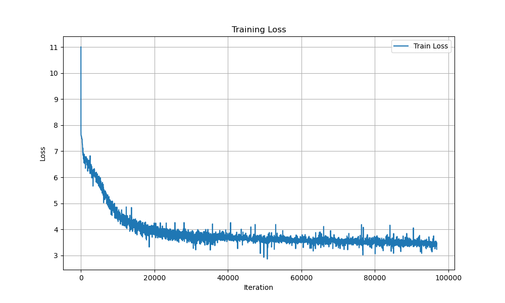

# BabyGPT
This is a transformer-based, 152M parameters language model (SLM) that is being trained on a single laptop with the following GPU specs

```
+---------------------------------------------------------------------------------------+
| NVIDIA-SMI 535.183.06             Driver Version: 535.183.06   CUDA Version: 12.2     |
|-----------------------------------------+----------------------+----------------------+
| GPU  Name                 Persistence-M | Bus-Id        Disp.A | Volatile Uncorr. ECC |
| Fan  Temp   Perf          Pwr:Usage/Cap |         Memory-Usage | GPU-Util  Compute M. |
|                                         |                      |               MIG M. |
|=========================================+======================+======================|
|   0  NVIDIA GeForce RTX 3080 ...    On  | 00000000:01:00.0  On |                  N/A |
| N/A   77C    P0             124W / 125W |  15369MiB / 16384MiB |    100%      Default |
|                                         |                      |                  N/A |
+-----------------------------------------+----------------------+----------------------+
                                                                                         
+---------------------------------------------------------------------------------------+
| Processes:                                                                            |
|  GPU   GI   CI        PID   Type   Process name                            GPU Memory |
|        ID   ID                                                             Usage      |
|=======================================================================================|
|    0   N/A  N/A      2114      G   /usr/lib/xorg/Xorg                           93MiB |
|    0   N/A  N/A     65679      C   python3                                   15266MiB |
+---------------------------------------------------------------------------------------+
```

## Training Progress 
The training logs can be accessed [HERE](https://github.com/amjadmajid/BabyGPT/blob/main/log.txt) and the training progress can be seen below
 

